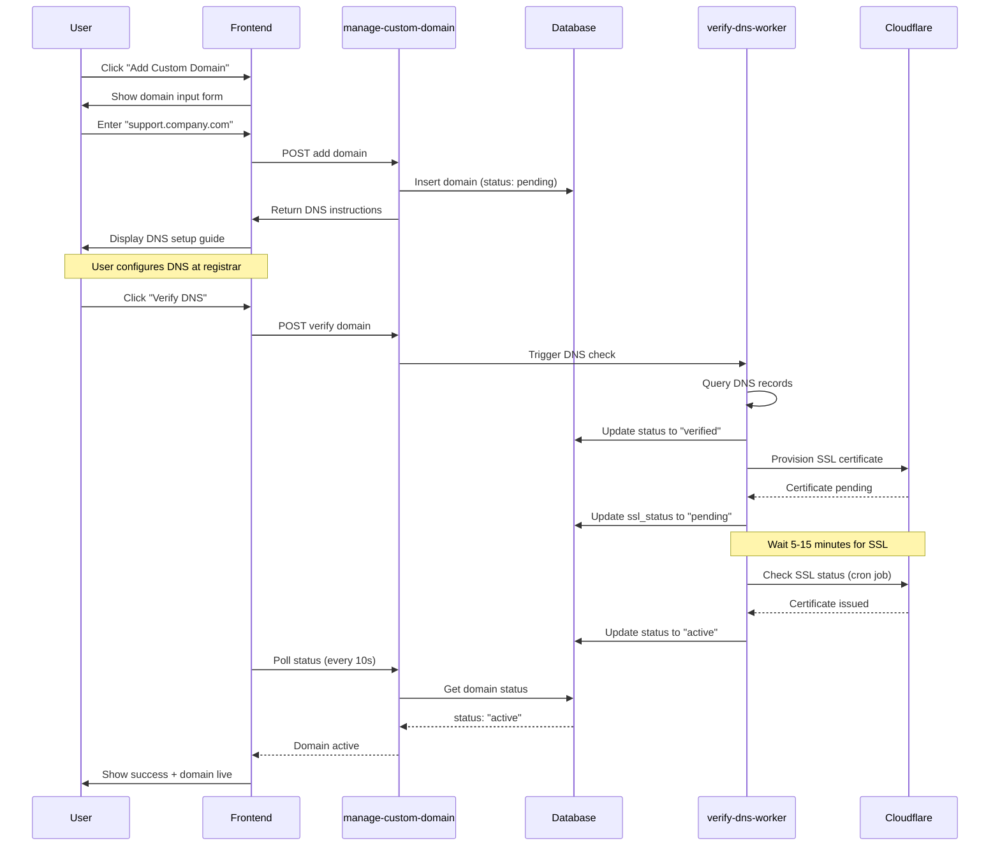

# Custom Domain Feature - Technical Specification

**Status:** 🟡 Backlog  
**Version:** 1.0  
**Last Updated:** 2025-01-10  
**Target Release:** TBD  
**Complexity:** High  
**Strategic Value:** Enterprise Feature / Revenue Driver

---

## Table of Contents

1. [Executive Summary](#executive-summary)
2. [Technical Specification](#technical-specification)
3. [User Experience](#user-experience)
4. [Implementation Timeline](#implementation-timeline)
5. [Cost Analysis](#cost-analysis)
6. [Security & Compliance](#security-compliance)
7. [Testing Strategy](#testing-strategy)
8. [Monitoring & Operations](#monitoring-operations)
9. [Documentation Requirements](#documentation-requirements)
10. [Rollout Plan](#rollout-plan)

---

## Executive Summary

### Feature Overview

Enable Enterprise customers to connect custom domains to individual chat instances (e.g., `support.company.com` → specific chat). This feature provides:

- **White-label branding** with custom domains per chat instance
- **Automatic SSL/TLS certificates** for all custom domains
- **DNS verification** to prevent domain hijacking
- **Multi-domain support** for Enterprise customers
- **Status tracking** and health monitoring

### Strategic Value

- **Enterprise Positioning**: Differentiator for high-value customers
- **Revenue Impact**: Justifies premium pricing ($99-$299/mo Enterprise tier)
- **Competitive Advantage**: Most competitors don't offer per-instance custom domains
- **Customer Lock-in**: Increases switching costs once domains are configured

### Implementation Complexity

- **Difficulty:** High (8/10)
- **Estimated Effort:** 3-4 weeks (1 senior engineer)
- **Dependencies:** Cloudflare for SaaS, DNS infrastructure, SSL automation
- **Risk Level:** Medium (DNS propagation issues, SSL edge cases)

### Cost Summary

- **Development:** $19,000 (160 hours @ $120/hr)
- **Infrastructure:** $3,180/year (Cloudflare for SaaS + DNS workers)
- **Break-even:** 6 customers @ $49/mo or 3 customers @ $99/mo
- **ROI:** Positive after 3-4 Enterprise customers

---

## Technical Specification

### 1. Database Schema

#### 1.1 `custom_domains` Table

```sql
CREATE TABLE public.custom_domains (
  id UUID PRIMARY KEY DEFAULT gen_random_uuid(),
  chat_instance_id UUID NOT NULL REFERENCES public.chat_instances(id) ON DELETE CASCADE,
  user_id UUID NOT NULL REFERENCES auth.users(id) ON DELETE CASCADE,
  
  -- Domain information
  domain TEXT NOT NULL UNIQUE,
  is_primary BOOLEAN DEFAULT false,
  
  -- Verification
  status TEXT NOT NULL DEFAULT 'pending' CHECK (status IN (
    'pending',        -- Initial state, awaiting DNS configuration
    'verifying',      -- DNS records found, verification in progress
    'verified',       -- DNS verified, awaiting SSL
    'ssl_pending',    -- SSL certificate issuance started
    'active',         -- Fully active with SSL
    'failed',         -- Verification or SSL failed
    'offline'         -- Was active but DNS changed
  )),
  verification_token TEXT NOT NULL DEFAULT encode(gen_random_bytes(32), 'hex'),
  verified_at TIMESTAMPTZ,
  
  -- SSL/TLS
  ssl_status TEXT DEFAULT 'pending' CHECK (ssl_status IN (
    'pending',
    'issued',
    'renewing',
    'expired',
    'failed'
  )),
  ssl_issued_at TIMESTAMPTZ,
  ssl_expires_at TIMESTAMPTZ,
  
  -- DNS records (for display to user)
  dns_records JSONB,
  
  -- Error tracking
  last_error TEXT,
  error_count INTEGER DEFAULT 0,
  
  -- Timestamps
  created_at TIMESTAMPTZ DEFAULT now(),
  updated_at TIMESTAMPTZ DEFAULT now(),
  last_checked_at TIMESTAMPTZ,
  
  -- Constraints
  CONSTRAINT only_one_primary_per_chat UNIQUE (chat_instance_id, is_primary) WHERE is_primary = true
);

-- Indexes
CREATE INDEX idx_custom_domains_chat_instance ON public.custom_domains(chat_instance_id);
CREATE INDEX idx_custom_domains_user ON public.custom_domains(user_id);
CREATE INDEX idx_custom_domains_status ON public.custom_domains(status);
CREATE INDEX idx_custom_domains_domain ON public.custom_domains(domain);

-- Updated at trigger
CREATE TRIGGER update_custom_domains_updated_at
  BEFORE UPDATE ON public.custom_domains
  FOR EACH ROW
  EXECUTE FUNCTION public.update_updated_at_column();
```

#### 1.2 `domain_verification_logs` Table

```sql
CREATE TABLE public.domain_verification_logs (
  id UUID PRIMARY KEY DEFAULT gen_random_uuid(),
  custom_domain_id UUID NOT NULL REFERENCES public.custom_domains(id) ON DELETE CASCADE,
  
  check_type TEXT NOT NULL CHECK (check_type IN ('dns', 'ssl', 'health')),
  status TEXT NOT NULL CHECK (status IN ('success', 'failure', 'warning')),
  
  details JSONB,
  message TEXT,
  
  created_at TIMESTAMPTZ DEFAULT now()
);

CREATE INDEX idx_verification_logs_domain ON public.domain_verification_logs(custom_domain_id);
CREATE INDEX idx_verification_logs_created ON public.domain_verification_logs(created_at DESC);
```

#### 1.3 Row Level Security (RLS) Policies

```sql
-- Enable RLS
ALTER TABLE public.custom_domains ENABLE ROW LEVEL SECURITY;
ALTER TABLE public.domain_verification_logs ENABLE ROW LEVEL SECURITY;

-- custom_domains policies
CREATE POLICY "Users can view their own domains"
  ON public.custom_domains FOR SELECT
  USING (auth.uid() = user_id);

CREATE POLICY "Users can insert domains for their own chats"
  ON public.custom_domains FOR INSERT
  WITH CHECK (
    auth.uid() = user_id AND
    EXISTS (
      SELECT 1 FROM public.chat_instances
      WHERE id = chat_instance_id AND user_id = auth.uid()
    )
  );

CREATE POLICY "Users can update their own domains"
  ON public.custom_domains FOR UPDATE
  USING (auth.uid() = user_id);

CREATE POLICY "Users can delete their own domains"
  ON public.custom_domains FOR DELETE
  USING (auth.uid() = user_id);

-- domain_verification_logs policies
CREATE POLICY "Users can view logs for their domains"
  ON public.domain_verification_logs FOR SELECT
  USING (
    EXISTS (
      SELECT 1 FROM public.custom_domains
      WHERE id = custom_domain_id AND user_id = auth.uid()
    )
  );
```

#### 1.4 Database Functions

```sql
-- Function to enforce custom domain limits based on user plan
CREATE OR REPLACE FUNCTION public.enforce_custom_domain_limit()
RETURNS TRIGGER AS $$
DECLARE
  plan_info record;
  domain_count bigint;
  max_domains integer;
BEGIN
  -- Get user's plan
  SELECT * INTO plan_info
  FROM get_user_plan(NEW.user_id);
  
  -- Set max domains based on plan
  max_domains := CASE plan_info.plan_type
    WHEN 'enterprise' THEN 999999  -- Unlimited
    WHEN 'pro' THEN 0              -- Not available in Pro (yet)
    ELSE 0                          -- Free tier: no custom domains
  END;
  
  -- Count existing domains for this user
  SELECT COUNT(*) INTO domain_count
  FROM public.custom_domains
  WHERE user_id = NEW.user_id;
  
  -- Check limit
  IF domain_count >= max_domains THEN
    RAISE EXCEPTION 'Custom domain limit reached. Upgrade to Enterprise for custom domains.';
  END IF;
  
  RETURN NEW;
END;
$$ LANGUAGE plpgsql;

-- Attach trigger
CREATE TRIGGER enforce_custom_domain_limit_trigger
  BEFORE INSERT ON public.custom_domains
  FOR EACH ROW
  EXECUTE FUNCTION public.enforce_custom_domain_limit();
```

---

### 2. API Endpoints (Edge Functions)

#### 2.1 `manage-custom-domain` Edge Function

**Purpose:** Central function to manage all custom domain operations

**Endpoint:** `POST /functions/v1/manage-custom-domain`

**Methods:**

##### Add Domain
```typescript
// Request
{
  "action": "add",
  "chatInstanceId": "uuid",
  "domain": "support.company.com"
}

// Response
{
  "success": true,
  "domain": {
    "id": "uuid",
    "domain": "support.company.com",
    "status": "pending",
    "verificationToken": "abc123...",
    "dnsRecords": {
      "a_record": {
        "type": "A",
        "name": "@",
        "value": "185.158.133.1"
      },
      "txt_record": {
        "type": "TXT",
        "name": "_flowify-verification",
        "value": "flowify-verify=abc123..."
      }
    }
  }
}
```

##### Verify Domain
```typescript
// Request
{
  "action": "verify",
  "domainId": "uuid"
}

// Response
{
  "success": true,
  "status": "verified",
  "message": "DNS records verified successfully"
}
```

##### Check Status
```typescript
// Request
{
  "action": "check-status",
  "domainId": "uuid"
}

// Response
{
  "success": true,
  "domain": {
    "status": "active",
    "sslStatus": "issued",
    "sslExpiresAt": "2025-04-10T00:00:00Z",
    "lastCheckedAt": "2025-01-10T12:30:00Z"
  }
}
```

##### Remove Domain
```typescript
// Request
{
  "action": "remove",
  "domainId": "uuid"
}

// Response
{
  "success": true,
  "message": "Domain removed successfully"
}
```

##### Set Primary Domain
```typescript
// Request
{
  "action": "set-primary",
  "domainId": "uuid",
  "chatInstanceId": "uuid"
}

// Response
{
  "success": true,
  "message": "Primary domain updated"
}
```

#### 2.2 `verify-dns-worker` Edge Function

**Purpose:** Background worker to check DNS status for pending domains

**Trigger:** Cron (every 5 minutes) or manual invocation

**Logic:**
1. Fetch all domains with status `pending` or `verifying`
2. For each domain:
   - Check A record points to correct IP
   - Check TXT record contains verification token
   - Update status accordingly
   - Trigger SSL provisioning if verified
3. Log results to `domain_verification_logs`

#### 2.3 `cloudflare-ssl` Edge Function

**Purpose:** Provision SSL certificates via Cloudflare for SaaS

**Endpoint:** `POST /functions/v1/cloudflare-ssl`

**Actions:**
- `provision`: Create custom hostname in Cloudflare
- `check-status`: Get SSL certificate status
- `renew`: Force certificate renewal

**Cloudflare API Integration:**
```typescript
// Create custom hostname
POST https://api.cloudflare.com/client/v4/zones/{zone_id}/custom_hostnames
{
  "hostname": "support.company.com",
  "ssl": {
    "method": "txt",
    "type": "dv",
    "settings": {
      "min_tls_version": "1.2"
    }
  }
}
```

---

### 3. Frontend Components

#### 3.1 `CustomDomainManager.tsx`

**Location:** `src/components/CustomDomainManager.tsx`

**Features:**
- List all custom domains for a chat instance
- Add new domain with DNS instructions
- Real-time status updates
- Copy DNS records to clipboard
- Remove domains
- Set primary domain

**UI States:**
- Empty state (no domains)
- Adding domain (DNS setup instructions)
- Verifying (loading spinner + status)
- Active (green checkmark + SSL expiry)
- Failed (error message + retry button)

#### 3.2 Settings Page Integration

**Location:** `src/pages/Settings.tsx`

**Changes:**
- Add "Custom Domains" tab (visible only for Enterprise users)
- Display `<CustomDomainManager />` component
- Show plan upgrade CTA for non-Enterprise users

#### 3.3 Chat Page Domain Resolution

**Location:** `src/pages/Chat.tsx`

**Logic:**
```typescript
// On page load, determine which chat instance to load
const hostname = window.location.hostname;

if (hostname.includes('lovable.app')) {
  // Standard subdomain: chat-slug.lovable.app
  loadChatBySlug(slug);
} else {
  // Custom domain: support.company.com
  const customDomain = await supabase
    .from('custom_domains')
    .select('chat_instance_id')
    .eq('domain', hostname)
    .eq('status', 'active')
    .single();
  
  if (customDomain) {
    loadChatById(customDomain.chat_instance_id);
  } else {
    show404();
  }
}
```

---

### 4. Infrastructure Setup

#### 4.1 Cloudflare for SaaS Configuration

**Requirements:**
- Cloudflare Enterprise account OR Business plan with Custom Hostnames add-on
- Fallback origin configured (e.g., `origin.flowify.app`)
- DNS zone with wildcard DNS record

**Configuration:**
1. Set up fallback origin server:
   ```
   A record: origin.flowify.app → 185.158.133.1
   ```

2. Configure Cloudflare zone settings:
   - Enable "Custom Hostnames"
   - Set SSL/TLS mode to "Full (strict)"
   - Configure TLS settings (min version 1.2)

3. API credentials:
   - Zone ID
   - API Token with permissions:
     - `Zone.SSL and Certificates:Edit`
     - `Zone.Custom Hostnames:Edit`

#### 4.2 Edge Function Secrets

Required secrets in Supabase:
```bash
CLOUDFLARE_ZONE_ID=abc123...
CLOUDFLARE_API_TOKEN=your_token_here
CLOUDFLARE_FALLBACK_ORIGIN=origin.flowify.app
```

#### 4.3 DNS Verification Service

**Option A: Cloudflare Workers Cron**
- Deploy worker to check DNS every 5 minutes
- Cost: ~$5/month (included in Workers plan)

**Option B: Supabase Cron Extension**
- Use pg_cron to run PostgreSQL function
- Function calls edge function via HTTP
- Cost: Included in Supabase plan

**Recommended:** Option A (Cloudflare Workers) for reliability

---

## User Experience

### User Flow: Adding a Custom Domain



### Error Scenarios

| Scenario | User Message | Resolution |
|----------|-------------|------------|
| DNS not configured | "DNS records not found. Please add the records shown below." | Show DNS instructions again |
| Wrong DNS records | "DNS records found but incorrect. Please verify A and TXT records." | Highlight incorrect values |
| SSL provisioning failed | "SSL certificate could not be issued. Please contact support." | Show support contact, log error |
| Domain already in use | "This domain is already connected to another account." | Prevent hijacking, show error |
| Plan limit reached | "Upgrade to Enterprise to add custom domains." | Show upgrade CTA |

---

## Implementation Timeline

### Phase 1: Foundation (Week 1)
**Goal:** Database schema + basic API

**Tasks:**
- [ ] Create database migration for `custom_domains` table
- [ ] Create database migration for `domain_verification_logs` table
- [ ] Add RLS policies
- [ ] Create `enforce_custom_domain_limit()` function
- [ ] Scaffold `manage-custom-domain` edge function
- [ ] Implement "add" and "remove" actions
- [ ] Write unit tests for database functions

**Deliverable:** Can add/remove domains via API

---

### Phase 2: DNS Verification (Week 2)
**Goal:** DNS checking + verification flow

**Tasks:**
- [ ] Implement DNS query logic in `verify-dns-worker`
- [ ] Add verification logging to `domain_verification_logs`
- [ ] Implement "verify" action in `manage-custom-domain`
- [ ] Create cron job for background DNS checks
- [ ] Add status polling endpoint
- [ ] Write integration tests for DNS verification

**Deliverable:** DNS verification working end-to-end

---

### Phase 3: SSL Integration (Week 3)
**Goal:** Cloudflare for SaaS SSL provisioning

**Tasks:**
- [ ] Set up Cloudflare for SaaS account
- [ ] Configure fallback origin
- [ ] Implement `cloudflare-ssl` edge function
- [ ] Integrate SSL provisioning into verification flow
- [ ] Add SSL status tracking
- [ ] Implement certificate renewal logic
- [ ] Test SSL issuance with test domains

**Deliverable:** SSL certificates auto-provisioned

---

### Phase 4: Frontend + Production (Week 4)
**Goal:** UI + production readiness

**Tasks:**
- [ ] Build `CustomDomainManager` component
- [ ] Integrate into Settings page
- [ ] Add domain resolution logic to Chat page
- [ ] Implement real-time status updates
- [ ] Add plan gating (Enterprise only)
- [ ] Write E2E tests (Playwright)
- [ ] Set up monitoring and alerts
- [ ] Write user documentation
- [ ] Production deployment

**Deliverable:** Feature ready for beta customers

---

## Cost Analysis

### Development Costs

| Role | Hours | Rate | Total |
|------|-------|------|-------|
| Senior Engineer | 120h | $120/hr | $14,400 |
| DevOps Engineer | 20h | $120/hr | $2,400 |
| QA Engineer | 20h | $100/hr | $2,000 |
| **Total Development** | | | **$18,800** |

### Infrastructure Costs (Annual)

| Service | Cost | Notes |
|---------|------|-------|
| Cloudflare for SaaS | $250/mo × 12 | Base plan for custom hostnames |
| SSL Certificates | Included | Let's Encrypt via Cloudflare |
| DNS Worker (Cloudflare) | $5/mo × 12 | Cron job for DNS checks |
| Additional Supabase Storage | $0 | Negligible (~100KB per domain) |
| **Total Annual** | **$3,180** | |

### Break-Even Analysis

**Assumptions:**
- Enterprise plan: $99/mo (includes custom domains)
- Pro plan with add-on: $49/mo + $20/mo custom domain add-on
- Development cost amortized over 12 months: $1,566/mo

**Break-Even:**
- **Enterprise tier:** 3 customers ($99/mo × 3 = $297/mo)
- **Pro + Add-on tier:** 6 customers ($69/mo × 6 = $414/mo)

**Conclusion:** Positive ROI after 3-4 Enterprise customers or 6-7 Pro customers with add-on.

---

## Security & Compliance

### 1. Domain Verification

**Challenge:** Prevent users from hijacking domains they don't own

**Solution:**
- Require TXT record with unique verification token
- Verification token: 64-character hex string (gen_random_bytes(32))
- Token regenerated on each verification attempt
- DNS checked server-side (never trust client)

**Process:**
1. User adds domain → System generates token
2. User adds TXT record: `_flowify-verification.example.com` → `flowify-verify=abc123...`
3. System queries DNS for TXT record
4. If token matches → Domain verified
5. If token missing/wrong → Verification failed

### 2. Plan Enforcement

**Mechanism:** Database trigger `enforce_custom_domain_limit_trigger`

**Logic:**
- Free: 0 custom domains
- Pro: 0 custom domains (future: 1 with add-on)
- Enterprise: Unlimited

**Implementation:**
```sql
CREATE TRIGGER enforce_custom_domain_limit_trigger
  BEFORE INSERT ON public.custom_domains
  FOR EACH ROW
  EXECUTE FUNCTION public.enforce_custom_domain_limit();
```

### 3. SSL/TLS Security

**Requirements:**
- Minimum TLS 1.2
- HTTPS enforced (HTTP → HTTPS redirect)
- Certificate auto-renewal (Let's Encrypt 90-day certs)
- HSTS headers enabled

**Cloudflare Configuration:**
```javascript
// SSL settings
{
  "min_tls_version": "1.2",
  "ssl": "strict",
  "always_use_https": true,
  "opportunistic_encryption": true
}
```

### 4. Data Privacy

**User Data:**
- Domain ownership verified via DNS (public data)
- No sensitive data stored in DNS records
- Verification logs include only technical details (no PII)

**Compliance:**
- GDPR: Domain data deleted when user deletes account (CASCADE)
- CCPA: Users can request domain deletion via API

---

## Testing Strategy

### 1. Unit Tests

**Database Functions:**
- `enforce_custom_domain_limit()` 
  - ✓ Allows Enterprise users to add domains
  - ✓ Blocks Free/Pro users
  - ✓ Respects plan limits

**Edge Functions:**
- `manage-custom-domain` actions (add, verify, remove, etc.)
- DNS query logic
- SSL provisioning logic

### 2. Integration Tests

**DNS Verification Flow:**
- Add domain → DNS records generated correctly
- Verify domain → DNS queried and validated
- Status transitions: pending → verifying → verified → active

**SSL Flow:**
- Domain verified → SSL provisioning triggered
- Cloudflare API called with correct parameters
- Certificate status updated in database

### 3. End-to-End Tests

**Happy Path:**
1. User adds domain `test.example.com`
2. System shows DNS instructions
3. User configures DNS
4. User clicks "Verify"
5. System verifies DNS
6. System provisions SSL
7. Domain becomes active
8. Chat loads on `test.example.com`

**Error Cases:**
- DNS not configured → Show error
- Wrong DNS records → Show specific issue
- SSL fails → Log error, show support contact
- Domain already exists → Prevent duplicate

### 4. Load Testing

**Scenarios:**
- 100 domains added simultaneously
- 1000 domains in DNS verification queue
- DNS worker processing time under load

**Tools:** k6 or Artillery

---

## Monitoring & Operations

### 1. Key Metrics

| Metric | Alert Threshold | Action |
|--------|----------------|--------|
| Domain verification success rate | < 90% | Investigate DNS worker |
| SSL provisioning success rate | < 95% | Check Cloudflare API |
| Average time to "active" status | > 30 minutes | Optimize DNS polling |
| Failed domain count | > 10 | Review error logs |
| SSL expiry warnings | < 7 days | Trigger renewal |

### 2. Logging

**Required Logs:**
- DNS verification attempts (with results)
- SSL provisioning requests/responses
- Domain status changes
- API errors with stack traces

**Log Retention:** 30 days

### 3. Alerts

**Critical:**
- Cloudflare API down
- SSL provisioning failure rate > 10%
- DNS worker stopped

**Warning:**
- Domain verification rate < 90%
- SSL certificates expiring soon (< 7 days)

### 4. Support Runbooks

**Issue: Domain not verifying**
1. Check DNS records with `dig` or `nslookup`
2. Verify TXT record matches verification token
3. Check DNS propagation (may take up to 72 hours)
4. Review `domain_verification_logs` for specific error

**Issue: SSL not provisioning**
1. Confirm DNS is verified
2. Check Cloudflare API status
3. Review Cloudflare dashboard for custom hostname
4. Check CAA records (must allow Let's Encrypt)
5. Manually retry SSL provisioning via API

---

## Documentation Requirements

### 1. User Documentation

**Guide: Adding a Custom Domain**
- Prerequisites (Enterprise plan required)
- Step-by-step instructions with screenshots
- DNS configuration for common registrars (GoDaddy, Namecheap, Cloudflare)
- Troubleshooting common issues
- Expected timeline (DNS propagation, SSL issuance)

**Guide: Managing Custom Domains**
- Viewing domain status
- Setting primary domain
- Removing domains
- Understanding status indicators

### 2. Developer Documentation

**API Reference:**
- `manage-custom-domain` endpoint documentation
- Request/response schemas
- Error codes and meanings
- Rate limits

**Architecture Diagram:**
- Component relationships
- Data flow (DNS verification → SSL provisioning)
- External dependencies (Cloudflare, DNS providers)

### 3. Support Documentation

**Internal Runbooks:**
- Common issues and resolutions
- How to manually verify DNS
- How to force SSL renewal
- How to investigate failed domains

---

## Rollout Plan

### Phase 1: Private Beta (Week 5-6)
**Audience:** 3-5 existing Enterprise customers

**Goals:**
- Validate DNS verification flow
- Test SSL provisioning in production
- Gather feedback on UX

**Success Criteria:**
- 100% of beta customers successfully add domain
- < 5% SSL provisioning failures
- Average time to "active" < 20 minutes

---

### Phase 2: Limited Availability (Week 7-8)
**Audience:** All Enterprise customers (opt-in)

**Goals:**
- Scale testing (20-30 domains)
- Monitor infrastructure under load
- Refine error messaging

**Success Criteria:**
- Domain verification success rate > 90%
- SSL provisioning success rate > 95%
- Support tickets < 2 per customer

---

### Phase 3: General Availability (Week 9+)
**Audience:** All Enterprise customers (default enabled)

**Goals:**
- Full production release
- Marketing announcement
- Enable Pro tier add-on (optional)

**Success Criteria:**
- Feature stable with > 95% uptime
- Positive customer feedback
- Revenue impact: +$500/mo within first quarter

---

## Appendix

### A. DNS Record Examples

**Root Domain:**
```
Type: A
Name: @
Value: 185.158.133.1
TTL: 3600
```

**Subdomain:**
```
Type: A
Name: support
Value: 185.158.133.1
TTL: 3600
```

**Verification TXT Record:**
```
Type: TXT
Name: _flowify-verification
Value: flowify-verify=abc123def456...
TTL: 3600
```

### B. Cloudflare API Examples

**Create Custom Hostname:**
```bash
curl -X POST "https://api.cloudflare.com/client/v4/zones/{zone_id}/custom_hostnames" \
  -H "Authorization: Bearer {api_token}" \
  -H "Content-Type: application/json" \
  -d '{
    "hostname": "support.company.com",
    "ssl": {
      "method": "txt",
      "type": "dv"
    }
  }'
```

**Check SSL Status:**
```bash
curl -X GET "https://api.cloudflare.com/client/v4/zones/{zone_id}/custom_hostnames/{id}" \
  -H "Authorization: Bearer {api_token}"
```

### C. Alternative Approaches Considered

| Approach | Pros | Cons | Decision |
|----------|------|------|----------|
| **Cloudflare for SaaS** | Automatic SSL, robust infrastructure, proven at scale | Expensive ($250/mo base), requires Enterprise plan | ✅ **Selected** (best balance) |
| **Let's Encrypt + Custom Nginx** | Full control, $0 cost | High maintenance, complex cert renewal, requires DevOps | ❌ Too much operational overhead |
| **AWS Certificate Manager** | Free SSL, integrated with AWS | Requires Route 53, limited to AWS ecosystem | ❌ Vendor lock-in |
| **Caddy Server** | Automatic SSL, simple config | Self-hosted, scaling challenges | ❌ Infrastructure complexity |

**Final Decision:** Cloudflare for SaaS provides the best balance of automation, reliability, and developer experience despite higher cost.

---

## References

- [Cloudflare for SaaS Documentation](https://developers.cloudflare.com/cloudflare-for-platforms/cloudflare-for-saas/)
- [Let's Encrypt DNS Validation](https://letsencrypt.org/docs/challenge-types/#dns-01-challenge)
- [Supabase Edge Functions Guide](https://supabase.com/docs/guides/functions)
- [DNS Best Practices (IETF RFC 8499)](https://datatracker.ietf.org/doc/html/rfc8499)

---

**Document Version History:**

| Version | Date | Author | Changes |
|---------|------|--------|---------|
| 1.0 | 2025-01-10 | Technical Team | Initial specification |

---

*This document is a living specification and will be updated as implementation progresses.*
